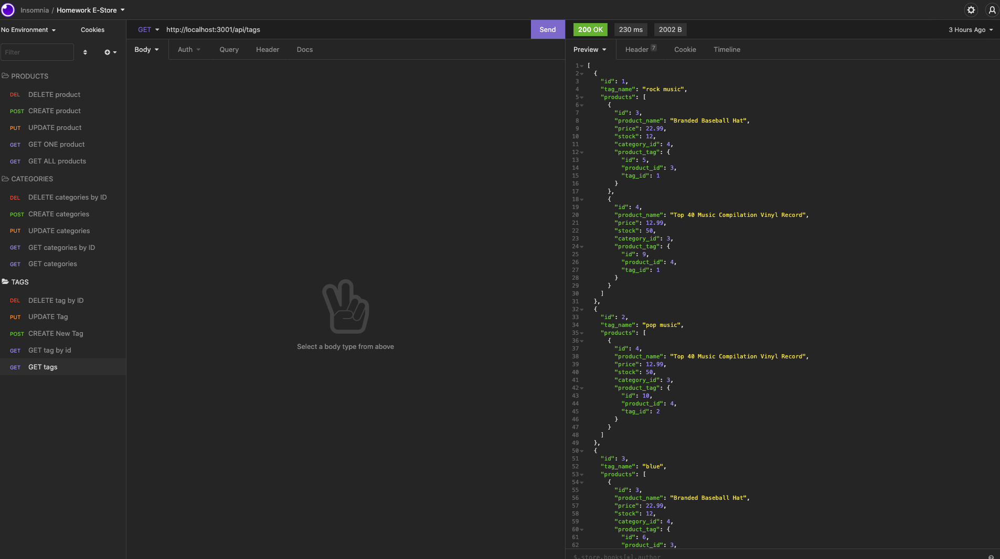

# E-Commerce-Back-End

## Description 
This application allows the user to create a database with the values of their inventory supply, pricing, and category. This is an entirely backend application. 

https://watch.screencastify.com/v/0CVeyG3OcVj6lnxouVnI

---

## Installation 
You will need to have to download a couple of dependencies like: dotevn, express, mysql2, and sequelize packages. 

---

## Built With: 
JavaScript 

NodeJS 

MySQL2 

Sequelize 

Dotenv 

Express

---

## Author 
Oscar Silva

---

## Question 
GitHub: https://github.com/Ozz760

Email: oscarsilva2356@gmail.com 